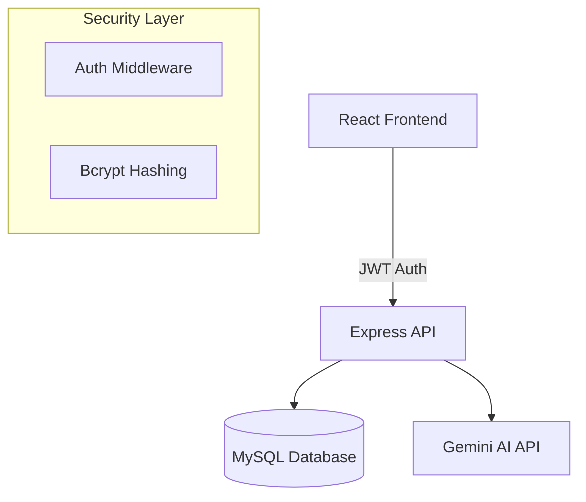

# SchoTask: AI-Augmented Student Productivity Platform

**SchoTask** is a premium, full-stack student planner designed to provide a "Zen-like" experience for academic management. It combines elite **Glassmorphic design** with **Gemini AI intelligence** to help students break down complex objectives into manageable actions.

---

## 🌟 The Vision
To empower students with a tool that is not only functional but also visually inspiring. SchoTask leverages modern design tokens and low-latency AI responses to reduce the cognitive load of academic planning.

## 🚀 Key Features

### 🤖 AI Brainstorming (Gemini 3 Flash)
- **Smart Sub-tasks**: Automatically generates relevant, structured sub-tasks for any academic objective.
- **Context Awareness**: Tailored specifically for student productivity (research, study, writing).

### 🔐 Enterprise-Grade Security
- **JWT Secure**: Industry-standard JSON Web Token authentication.
- **Encrypted Data**: Password hashing using `bcryptjs` for high-security storage.

### 🎨 Elite Visual Design
- **Glassmorphism**: Advanced CSS using backdrop-filters and custom HSL gradients.
- **Responsive**: Fully optimized for desktop, tablet, and mobile devices.

---

## 🛠️ Technical Tech Stack & Skills

### **Frontend**
- **React 19 & Vite**: High-performance component architecture.
- **Vanilla CSS3**: Mastery of custom design tokens, Flexbox/Grid, and animations.
- **Lucide Icons**: Crisp, professional iconography.

### **Backend**
- **Node.js & Express.js**: RESTful API design and middleware orchestration.
- **MySQL**: Relational database management and schema integrity.
- **JWT & Bcrypt**: Secure session and identity management.

### **Intelligence**
- **Google Generative AI**: Integration of Gemini 3 Flash for task decomposition.

---

## 🏗️ System Architecture

---

## 💻 Getting Started

### Backend Setup
1.  Navigate to `backend/`.
2.  Create a `.env` file (see `.env.example`).
3.  Import `schema.sql` into your MySQL instance.
4.  Run `npm install` and `npm start`.

### Frontend Setup
1.  Navigate to `frontend/`.
2.  Add `VITE_API_URL` to your environment (defaults to localhost:5000).
3.  Run `npm install` and `npm run dev`.

---

## 🧠 Development Journey
For a deep dive into the "Vibe Coding" methodology, architectural pivots, and the AI-assisted workflow used to build this project, see the [DEVELOPMENT_JOURNAL.md](./DEVELOPMENT_JOURNAL.md).

---

*This project demonstrates the power of "Agentic Coding"—balancing speed, aesthetics, and robust full-stack engineering.*
